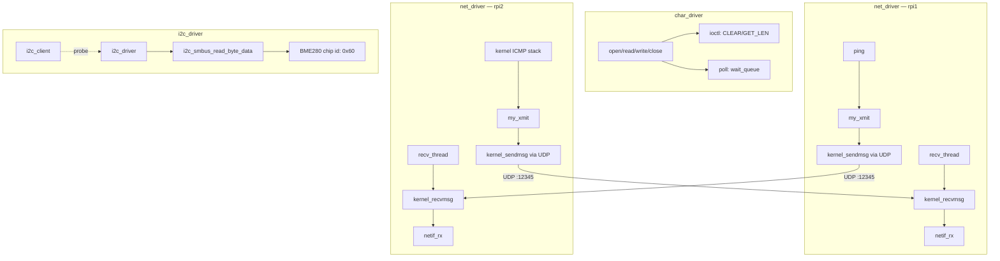

# RPi Kernel Drivers

Linux kernel modules built from scratch on Raspberry Pi 4B: a 
character driver with ioctl/poll support, a network driver 
implementing real bidirectional peer-to-peer UDP communication 
between two physical nodes, and an I2C sensor driver (BME280) — 
all built directly against the kernel I2C/netdevice APIs without 
device tree overlays.

## Architecture

Three independent kernel modules, each demonstrating a different 
Linux driver subsystem:

**char_driver**: standard file_operations model (open/read/write/
close) plus ioctl for control commands and poll for event-driven 
blocking reads.

**net_driver**: a virtual netdevice (`mynet0`) that doesn't just 
drop packets — it actually transmits and receives real ICMP traffic 
between two Raspberry Pis over UDP, letting the Linux network stack 
itself generate ping replies.

**i2c_driver**: manually registers an `i2c_client` (no device tree) 
and pairs it with an `i2c_driver` via the standard probe/remove model 
to read the BME280 chip ID through the kernel I2C framework.

## Debugging Highlights

### ARP blocked all traffic on the virtual netdevice

**Symptom**: `ping` between the two Pis returned `Destination Host 
Unreachable`, and `my_xmit()` was never even called.

**Root cause**: `alloc_etherdev()` creates an Ethernet-type device, 
so the kernel tries to resolve the destination's MAC address via 
ARP before transmitting. This driver never implemented an ARP 
responder, so resolution failed silently.

**Fix**: `dev->flags |= IFF_NOARP` — tells the kernel to skip ARP 
and call `ndo_start_xmit` directly.

### Packets were sent but never received

**Symptom**: After fixing ARP, `dmesg` confirmed `my_xmit()` was 
firing (98-byte packets matching ICMP echo), and `kernel_sendmsg()` 
reported success — but `ping` still showed 100% packet loss.

**Root cause**: nothing on the receiving Pi was listening on UDP 
port 12345. The packet arrived at the OS level and was silently 
dropped.

**Fix**: added a receive path — a UDP socket bound to port 12345 
via `kernel_bind()`, polled in a dedicated `kthread_run()` thread 
(blocking receive can't run inside `module_init()`, since `insmod` 
is a synchronous syscall that must return promptly). Received bytes 
are repackaged into a fresh `sk_buff` (`dev_alloc_skb`, `skb_reserve`, 
`skb_put`, `eth_type_trans`) and injected back into the stack with 
`netif_rx()`.

**Result**: once packets were re-injected via `netif_rx()`, the 
kernel's own ICMP stack generated the echo reply automatically — 
no ICMP logic was written by hand. `ping` went from 100% loss to 
0% loss, 3/3 replies received.

### i2c_client vs i2c_driver separation

Without a device tree overlay describing the manually-wired BME280, 
the client had to be created by hand: `i2c_get_adapter(1)` + 
`i2c_board_info` + `i2c_new_client_device()`. Registering the 
`i2c_driver` afterward triggers `probe()` the moment the client/driver 
names match — confirmed by dmesg ordering (`chip id = 0x60` logs 
before `module loaded`).

## What I Learned

Doing register-level I2C on STM32 first, then writing this I2C 
driver in Linux, made the abstraction concrete instead of abstract. 
`i2c_smbus_read_byte_data()` is one function call, but it performs 
the exact same nine-step transaction (START, address+write, 
register, repeated START, address+read, STOP) that I hand-wrote 
and debugged on bare metal — Linux just delegates it to a 
platform-specific I2C controller driver so the same API works 
across completely different hardware.

The network driver debugging also reinforced a pattern I first hit 
on the STM32 CAN driver: don't guess, isolate the variable. When 
`ping` failed silently, the fastest path to the real cause was 
testing with `Medium` removed entirely (network driver) or testing 
Low+High alone (an earlier FreeRTOS priority-inversion experiment) 
— confirming the parts that worked before searching for what didn't.

The most interesting discovery was unplanned: `netif_rx()` handing 
a packet to the kernel's network stack is enough for the kernel to 
generate a correct ICMP echo reply on its own. The driver never 
implements ICMP — it only has to look enough like a real network 
interface for the rest of the stack to take over.

## Build

Each driver has its own Makefile:

\`\`\`bash
cd char_driver && make    # or net_driver, i2c_driver
sudo insmod <module>.ko
dmesg | tail
sudo rmmod <module>
\`\`\`

## Repo Structure

| Directory | Contents |
|---|---|
| `char_driver/` | file_operations driver, ioctl/poll, user-space test programs, debug log |
| `net_driver/` | virtual netdevice with UDP-backed peer-to-peer transport |
| `i2c_driver/` | I2C client/driver reading BME280 chip ID |
